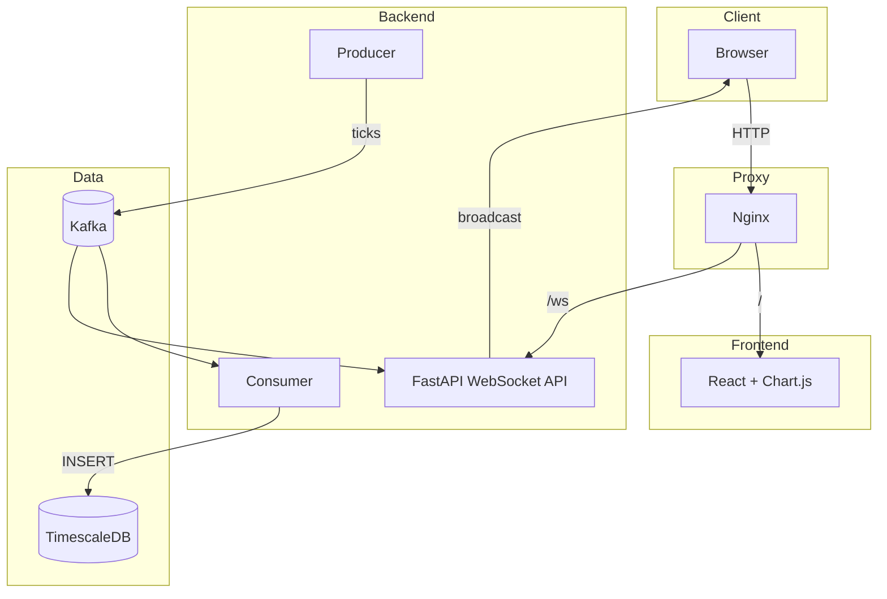
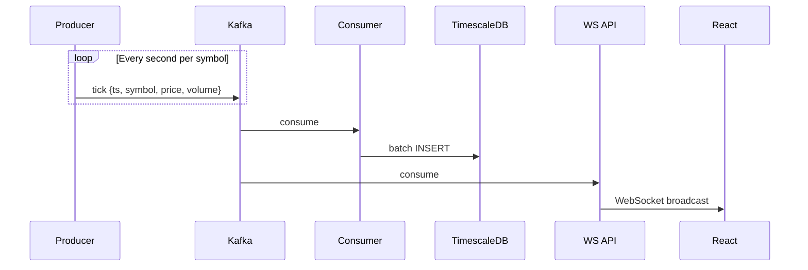

# BullBearSim — Real-Time Market Data Pipeline

[](https://www.python.org)
[](https://kafka.apache.org)
[](https://www.timescale.com)
[](https://react.dev)
[](https://www.typescriptlang.org)
[](https://www.docker.com)

Real-time market data streaming platform. Kafka ingests synthetic stock ticks, TimescaleDB persists them as time-series, a WebSocket API broadcasts to a React + Chart.js dashboard — all running in Docker Compose.
This project demonstrates the complete lifecycle of real-time streaming data—from event generation to storage, broadcast, and visualization.

### Project Highlights

- End-to-end event-driven architecture with Apache Kafka streaming
- Time-series data storage with TimescaleDB hypertables
- Live dashboard powered by WebSocket broadcasting via FastAPI
- Realistic synthetic market simulation (11 instruments, 5 sectors)
- Containerized microservices with Docker Compose and Nginx
- React + TypeScript dashboard for real-time visualization


> **🌐 Live Demo**
Coming Soon (Deployment in Progress)

> **📊 Architecture Diagram**
See below

> **🖼️ Dashboard Screenshot**
images/dashboard-overview.png

---

## Architecture



7 Docker services — `kafka`, `postgres` (TimescaleDB), `app` (producer), `consumer`, `ws_api`, `frontend`, `nginx`.

---

## Data Flow



---

## Why I Built This

To learn event-driven architecture hands-on. Kafka for decoupled streaming, TimescaleDB for time-series storage, WebSockets for live broadcast. The dashboard exists to visualize the pipeline — the pipeline is the point.

---

## Key Features

- **Kafka Streaming** — Decoupled producer/consumer model with two independent consumer groups
- **TimescaleDB** — Hypertable with automatic partitioning and 30-day retention policy
- **WebSocket Broadcast** — FastAPI server fans out ticks to all connected dashboard clients
- **Realistic Simulation** — 11 symbols across 5 sectors with TrendEngine and session-based volatility
- **React + Chart.js Dashboard** — Live charts, top movers, symbol strip — all TypeScript
- **Containerized** — 7 services orchestrated via Docker Compose with Nginx reverse proxy

---

## Simulation Overview

11 instruments across 5 sectors (INDEX, BANKING, IT, ENERGY, FMCG), each with a base price and volatility profile calibrated to its sector. TrendEngine drives market phases with smooth transitions; SectorEngine adds correlated noise. Session-based multipliers adjust volatility and volume throughout the trading day. No external APIs required — the engine runs entirely within Docker.

---

## Technology Stack

| Layer | Technology |
|-------|-----------|
| Streaming | Apache Kafka 7.5 (single-node, KRaft mode) |
| Storage | TimescaleDB (PostgreSQL 14 + hypertables) |
| Producer | Python 3.11, aiokafka, asyncio |
| Consumer | Python 3.11, aiokafka, asyncpg |
| WebSocket API | Python, FastAPI, aiokafka |
| Frontend | React 18, TypeScript, Chart.js, TailwindCSS, Vite |
| Infrastructure | Docker Compose, Nginx |

---

## Screenshots

| Overview | Price Chart |
|----------|-------------|
| `images/dashboard-overview.png` | `images/live-chart.png` |

**Demo GIF** (15s, 1080p): Load page → watch ticks update the price chart → click a different symbol → observe top movers react.

---

## Getting Started

```bash
git clone <repo-url> && cd realtime-stock-streaming
cp .env.example .env          # edit passwords
docker compose up -d          # starts all 7 services
open http://localhost
```

Verify with `docker compose ps`. Ticks flow at 11/sec.

---

## Local Development (Frontend)

```bash
cd frontend && npm install && npm run dev
```

Vite proxies `/ws` to the Docker stack on `localhost:80`.

---

## Project Structure

```
├── app/                  Market simulation producer (Python)
├── consumer/             Kafka consumer → TimescaleDB writer (Python)
├── ws_api/               WebSocket broadcast API (FastAPI)
├── frontend/             React + TypeScript dashboard (Vite)
├── dev/                  Local dev utilities + nginx config
├── nginx.conf            Production reverse proxy config
├── docker-compose.yml    All 7 services defined here
└── init.sql              TimescaleDB schema + retention policy
```

---

## Engineering Decisions

**Why Kafka?** Decouples producer from consumers. Both the DB writer and WebSocket API read the same topic independently. Enables replay and future consumer additions.  
**Why TimescaleDB?** Hypertables provide automatic time-based partitioning, efficient range queries, and built-in retention — all in standard PostgreSQL.  
**Why WebSockets?** Push-based broadcast suits live financial data. Polling adds latency. FastAPI + asyncio handles hundreds of concurrent clients.  
**Why Synthetic Data?** Self-contained — no API keys or external dependencies. TrendEngine + sector noise produces realistic price action.  
**Why React over Grafana?** Full control over the visualization layer, native WebSocket integration, and version-controlled dashboard code.

---

## Engineering Challenges

**Docker Networking**. Internal network isolates backend services; Nginx bridges to the public. Required careful `depends_on` configuration for startup ordering.  
**Nginx WebSocket Proxying**. WebSocket upgrades need specific headers. Initial config proxied `/ws` to the wrong upstream — fixed by understanding `$http_upgrade` semantics.  
**Grafana → React Migration**. Original dashboard used Grafana + PostgreSQL. Migrated incrementally: proved WebSocket broadcast worked, then replaced panels one by one.  
**Simulation Engine Design**. Early ticks were random walks. TrendEngine adds persistent market phases with smooth transitions. SectorEngine creates correlated noise.

---

## Lessons Learned

- Kafka consumer groups enable independent readers. The DB writer and WS API use separate groups — restarting one doesn't affect the other.
- WebSocket reconnection with exponential backoff (1s → 30s) handles transient failures without flooding the server.
- A fixed 100-tick buffer keeps the chart window stable. Computing change from the first visible tick keeps the UI consistent.
- TailwindCSS dark palette (`gray-950`/`gray-900`/`gray-800`) produces a professional look with minimal CSS.

---

## Project Evolution

**Phase 1** — Kafka + TimescaleDB + Grafana. Proved the pipeline concept.  
**Phase 2** — FastAPI WebSocket server + custom React + Chart.js dashboard. Migrated away from Grafana incrementally.  
**Phase 3** — Redesigned simulation engine (11 symbols, 5 sectors, TrendEngine). Polished the dashboard. This README.

---

## Future Roadmap

- **Historical Replay** — Replay past ticks from TimescaleDB at configurable speed
- **Provider Abstraction** — Swap the synthetic producer with real market data APIs
- **Cloud Deployment** — Terraform scripts for ECS/K8s with managed Kafka and TimescaleDB

---

## Deployment

| Target | Status |
|--------|--------|
| Docker Compose | Complete |
| Nginx reverse proxy | Complete |
| Cloud (AWS) | In Progress |
| DNS (Cloudflare) | In Progress |

The production nginx configuration (`nginx.conf`) includes SSL termination and Cloudflare headers. Terraform modules for ECS deployment are part of the Future Roadmap.

---

## License

MIT
